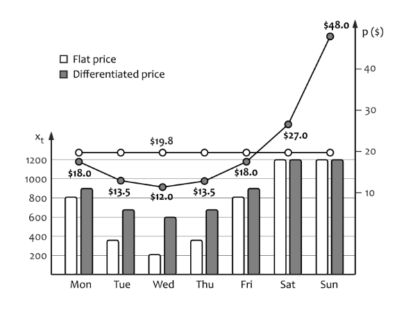

```{r setup, include=FALSE}
# clean up the environment
rm(list = ls())
gc()

# setup chunk options
knitr::opts_chunk$set(
  message = FALSE,
  warning = FALSE,
  fig.align = "center",
  comment = "#>"
)

options(scipen = 9999)
```

# Price Optimization

A demand model enables us to search for the optimal price by analyzing how the price changes increase or decrease the profits. In practice, however, we face numerous constraints and interdependencies that require much more elaborate and specialized optimization models to be developed. From [AI for Marketing Operation] Book, most of the constraints fall into one of the following three categories: **supply constraints, demand constraints, and structural constraints**.

* Supply constraints can be imposed by limited resource capacity, such as the fixed number of seats in an Airlines or Cinema.
* Demand constraints are often related to imperfect consumer segmentation, interdependency of the demands on substitutable products, demand changes over time, and demand uncertainty, in the sense that the demand cannot be predicted accurately. 
* Structural constraints are related to operational and legal conditions that might require suboptimal but practicable solutions to be selected.

We will discuss those constraints later, but for now let's begin for the simple one example.

## Constant Price optimization

In this case, we are going to use demand models to find the optimal prices recommendation. Here is the synthetic data we generate for academic purpose. The data is regarding the sales of shoes from a factory located in Bandung. Each row represents the price and total shoes sold at time-t, where aggregated from weekly transactions. Let's read and glimpse the data.

```{r}
# load libraries

library(tidyverse)
library(pracma)
library(lubridate)
```


```{r}
shoes <- read_csv(file = "data/shoes.csv")
glimpse(shoes)
```

### Demand Function

Since we are going to use demand function to find the optimum price, we need to know common type of demand model called linear model. The demand is given by:

$$d(p) = \beta + \alpha * price$$
$$d'(p) = \alpha$$

where $\alph$ is a slope of the curve and $\beta$ is the intercept. In general setting, the total profit function can defined as:

$$L(p) = d(p)(p-c)$$
$$u'p*vp + up*v'p$$

where, $L$ gives the profit, $d$ is demand function that depends of the price and $c$ is the *marginal cost*. From mathematical-wise, if we want to optimize the function, find the local/global minimum or local/global maximum, we can use the partial derivative technique. For you who want to deep dive this concept, please lookup to [this articel](https://www.whitman.edu/mathematics/calculus_online/section06.01.html). So, taaking the derivative with respect to price we have:

$$L'(p) = d'(p)(p-c) + d(p)$$
making $L'(p) = 0$ to calculate the optimum price (first order condition), we have: 

$$d'(p^*)(p^*-c)+d(p^*) = 0 \\ d'(p^*)p^*+d(P^*) - d'(p^*)c$$

Since  $d'(p) = \alpha$ the formula be like:

$$d'(p^*)p+d(p^*) = d'(p^*)c, \\ \alpha p^* + \alpha p^* + \beta = \alpha c, \\ p^* = \frac{\alpha c - \beta}{2 \alpha}.$$

### Fit a demand model

let’s see how to calculate the optimum prices for this demand functions. Assumed that the *marginal cost* is $50. So we create an object called `mc` with value 50. For the demo purpose, we will only use Semarang region. So lets first subset the data.

```{r}
mc <- 50

shoes_filter <- shoes %>% 
  filter(region == "Semarang")

shoes_filter %>% 
  head()
```

Next, we create a new column `profit` which is the calculation of profit with the formula we discussed earlier.

```{r}
shoes_agg <- shoes_filter %>% 
  mutate(profit = quantity*(price-mc))

head(shoes_agg)
```

Create a linear model in R is as convenient as you’d wish it to be. We will call the `lm()` function and specify two parameters: the `formula` for our linear model and the `data` from which our model is built from. Notice that we will saved model_lm as a linear model and we can now use the attributes of model_lm, such as its $coefficients to create our price optimization later.


```{r}
shoes_agg %>% 
  ggplot(mapping = aes(x = price, y = quantity)) +
  geom_point()
```

```{r}
# Fit of the demand model

model_lm <- lm(formula = quantity~price, data = shoes_agg)
summary(model_lm)
```

slope -> slope nya bernilai negatif, karena korelasi antara price dan quantity juga negatif. artinya ketika price nya semakin tinggi maka berdampak pada quantity produk terjual semakin sedikit.

variabel price signifikan mempengaruhi variabel quantity karena pvalue lebih kecil dibandingkan 0.05.

From the output of the `summary()` call, we see the two coefficients that represent our *model line*. The point at which our line crosses the y-intercept is 13726.073 ($\alpha$) and the slope ($\beta$) is -90.679. 

```{r}
# extract slope and intercept from the model.

alpha <- model_lm$coefficients[2]
beta <-  model_lm$coefficients[1]
```

```{r echo=FALSE}
cat("aplha:", alpha, "\n")
cat("beta:", beta)
```

### Find Optimal Price

Next, we will create a new column called `profit_fitted` to *estimate the profit* from the `model_lm`. The idea is to compare the actual profit, and the estimated profit derived from the model.


```{r}
shoes_agg <- shoes_agg %>% 
  mutate(profit_fitted = model_lm$fitted.values*(price - mc))

shoes_agg %>% 
  head()
```

Then, we are going to find the optimal price. So we need to substitute. the `alpha` and `beta` values that we obtained before, with the derivative formula of profit. 

$$p^* = \frac{\alpha c - \beta}{2 \alpha}$$


```{r}
# Optimal Price

price_max_profit <- (alpha*mc - beta)/(2*alpha)

profit_max <- predict(model_lm, newdata = data.frame(price = price_max_profit))*(price_max_profit - mc)
```

```{r}
price_max_profit
```

```{r}
profit_max
```
To convince you, here is the graphic result.

```{r}
# Plots

ggplot(shoes_agg) + aes(x = price, y = profit) +
  geom_point() + 
  geom_vline(xintercept = price_max_profit, lty = 2) +
  geom_hline(yintercept = profit_max, lty = 2) +
  geom_line(aes(x = price, y = profit_fitted), color = 'red') +
  annotate(geom = "label", x = price_max_profit, y = profit_max+(profit_max*0.15), label = paste("Optimal Price at $", round(price_max_profit,2)))
```

From result above, the right price to optimize the profit is about $ 100.68. This look make sense, because from the historical data and graphic, if we shift the price value to the right (which mean increasing value), there will possibility that customer are reluctant to buy the produt so the profit decreases.

**Dive Deeper:** it's your turn to try to find optimal prices for other regions. Please create a new chunk below and you can follow the previous step.


```{r}
# your solution here

```

## Dynamic Price with time interval

Price Differentiation:

* Differentiation with demand shifting

The shifting effect is especially important in cases of constrained supply because it can help to achieve a more even demand distribution and reduce stockout. For example, the supply of seats in a Cinema is fixed but the demand can vary significantly, typically reaching its maximum on the weekend and its minimum on weekdays. The Cinema can lose potential revenue if the peak demand on the weekends exceeds the capacity. We can expect that setting variable ticket prices for different days of the week can improve profits because the higher demand on the weekends enables the Cinema to charge higher prices and make better margins, please look at following graphic:

```{r echo=FALSE, out.width="800px", fig.cap="Example of ticket price optimization for a Cinema. The vertical bars represent the number of seats sold, and the points are the ticket prices for the corresponding days."}

```

* Differentiation with constrained supply

The previous method for price optimization we have considered a demand function to setting prices that maybe the optimal possible profit. Those assumption is reasonably fair, for some industries, like supermarket, where stockouts are rare. However, it does not hold in many other industries that face different supply constraints. In this section, we will discuss a relatively simple case, in which each market segment has a fixed capacity of a product and we need to find the optimal global price or segment-level prices

### Introduction Linear Programming

We will use method called *linear programming* to optimize the objective function. Here is a brief explanation about linear programming. Linear Programming is basically a subset of optimization. Linear programming or linear optimization is an optimization technique wherein we try to find an optimal value for a linear objective function for a system of linear constraints using a varying set of decision variables. Its also known as sensitivity analysis. There are two important things:

* sensitivity of the optimal solution to changes in the available resources, i.e., the right hand side (RHS) of the constraint
* sensitivity of the optimal solution to the changes in unit profit or unit cost, i.e., coefficient of the objective function.

Case study:

A retailer is going to divide their 50 factory between two groups. Production cost for group A is `$10` per factory. Production cost for group B is `$20` per factory. The retailer can spend at most `$700` on production seed. If group B brings in a profit of `$150` per factory and group A brings a profit of `140` per factory, how many factories should the retailer push to maximize their profit?

Lets create an objective function:

$$P = 140a + 150b$$
where a is the number of factories of group A, and b is vice versa. 

Constraints:

$$a + b \leqslant 50 \\ 10a + 20b \leqslant 700 \\ a \geqslant 0 \\ b \geqslant 0 $$
### Convert objective function to R code

lets convert to R code:


linprog:

- cc = fungsi tujuan / fungsi objective
- Aeq = constraint
- beq = RHS (batas maksimum/minimum dari fungsi constraint)

```{r}

# setup objective function and constraints

obj_func <- c(140, 150)
constrain1 <- matrix(c(1,1,10,20), nrow = 2, byrow = T)
rhs1 <- c(50,700)

# linear programming

linprog(cc = obj_func, Aeq  = constrain1, beq =rhs1)
```
The maximum z value (and thus, the optimum) that can be obtained while satisfying the given constraints is 7200, where x1 = 30 and x2 = 20. So the maximum profit is 7200 when the retailer push 30 factory of group A and 20 factory of group B.

$$P = 140*30 + 150*20$$
```{r}
140*30 + 150*20
```

**Dive deeper**

A company manufactures and sell 2 type of product  "A" and "B". The cost of production of each unit A and B is `$2` and `$1` respectively. Each unit of A yields a profit of `$50` and each unit of B yields a profit of `$18` on selling. Company estimates the monthly demand of A and B to be at maximum of 80 units in all. The production budget for the month is set at `$ 100`. How many units should the company manufacture in order to earn maximum profit from its monthly sales of A and B?

objective function: 

$$P = 50A + 18B$$

constraint:

$$a + b \leqslant 80 \\ 2a + 1b \leqslant 100 \\ a \geqslant 0 \\ b \geqslant 0 $$ 

```{r}
# your code here

# setup objective function and constraints

obj_func2 <- c(50, 18) 
constrain2 <- matrix(c(1,1,2,1), nrow = 2, byrow = T) 
rhs2 <- c(80,100) 

# linear programming 

linprog(cc = obj_func2, Aeq = constrain2, beq =rhs2) 
```
> The maximum z value (and thus, the optimum) that can be obtained while satisfying the given constraints is 2080, where A = 20 and B = 60. So the maximum profit is $2080 when the company sell 20 product A and 60 product B.

### Case study

After you understand the basic concept is, lets go through the main topic, with `shoes` dataset. If the shoes retailer want to plans a four week sale campaign for a single product. We need to prepare the data first to get weekly demand vs pricing.

```{r}
data_agg <- shoes_filter %>% 
  mutate(week = ceiling(day(date) / 7)) %>% 
  filter(week != 5) %>% 
  select(week, price, quantity)

data_agg %>% 
  ggplot(aes(x = price, y = quantity)) +
  geom_point() +
  geom_smooth() +
  facet_wrap(facets = vars(week))
```
to get the *demand function*, we need to create a linear model model for each week group. Lets do it and look the intercept and slope value.

```{r}
fitted_models <- data_agg %>% 
  group_by(week) %>% 
  do(model = lm(quantity ~ price, data = .))
```

```{r}
cat("model linear minggu pertama: \n")

fitted_models$model[[1]] 

cat("--------- \n \n")

cat("model linear minggu kedua: \n")

fitted_models$model[[2]] 

cat("--------- \n \n")

cat("model linear minggu ketiga: \n")

fitted_models$model[[3]] 

cat("--------- \n \n")

cat("model linear minggu keempat: \n")

fitted_models$model[[4]] 
```


```{r}

# allowed price levels

price_list <- c(39, 59, 79, 99, 129, 149)

# t number of time intervals you want to recommend

t <- 4

# subtitute all price value to demand function

demand_w1 <- 12497.97 - 76.43*price_list
demand_w2 <- 15365.4 - 106.5*price_list
demand_w3 <- 13213.18 - 88.44*price_list
demand_w4 <- 14363.2 - 98.1*price_list
```

```{r}

demand_vec <- c(demand_w1, demand_w2, demand_w3, demand_w4)
demand_vec <- ifelse(demand_vec < 0, 0, demand_vec)
demand_mat <- matrix(demand_vec, nrow = 1, byrow = TRUE)

cat("demand matrix: \n \n")
demand_mat

```

```{r}

# Evaluate revenue for each demand function and each price level

# fungsi objektif

revenue_vec <- demand_vec*price_list


cat("revenue vector: \n \n")

revenue_vec
```

> Now we solve the following optimization problem: [Introduction to Algorithmic Marketing: AI for Marketing Operation](https://www.amazon.com/Introduction-Algorithmic-Marketing-Artificial-Intelligence/dp/0692989048)


$$\displaystyle \max_{z} \ \sum_{t=1}^{T}\sum_{i=1}^{K} z_{it} \ . \ P_i \ . \ q(p_i,t) \\ 
subject \ to \sum_{t=1}^{T}\sum_{i=1}^{K} z_{it} \ . \ q(P_i,t) \le C \\ 
\sum_{i=1}^{K} z_{it} = 1, \ for \ t = 1,...,T \\
z_{it} \ge 0$$

where q is demand, P is price, T is the number of time periods, and K is the number of price levels. Next we create the constraints formulas:

* First we generate a binary mask to ensure all Z's in one time interval sum up to 1. 
* Second, we ensure that the sum of all demands is less than the available stock level, that is $z_{it} \ . \ q(P_i,t) \le C$.

```{r}
# constraint --------------------------------------------------------

create_mat <- function(i, k) {
  
  # create zero matrix
  
  mat_array <- matrix(data = 0,
                      ncol = i * k,
                      nrow = i)
  
  # filling values for each row
  
  for (row_mat in 1:i) {
    mat_array[row_mat, (row_mat * k):(row_mat * k - (k - 1))] <- 1
  }
  return(mat_array)
  
}

constrain_1 <- create_mat(i = t, k = length(price_list))

constrain_2 <- rep(1, t)
```

Then, we do the linear program, and put all the value into the argument. Do not forget to determined the `b` argument, which is product capacity.

```{r}

# linear program

set.seed(9999)

result <- linprog(cc = revenue_vec,  A = demand_mat, b = 10000, Aeq = constrain_1, beq = constrain_2, maximize = T)

cat(paste("Total Revenue: $", round(result$fva, 2)), "\n \n")

cat("Price schedule: \n")

matrix(result$x, nrow = length(price_list), ncol = t, byrow = F) 
```

Each column of the solution matrix corresponds to a time period (one week). Each row corresponds to z value that can be interpreted as the percentage of time z't price level should be used in the corresponding time period. We can interpret, the optimal price is `$129` for the first, third, and fourth weeks when the capacity product is 10,000 items. For the same capacity, the price is fractional for the second week, which means a mix with 69% at `$99` and 31% at `$129`. 

with 10000 product stock available, we can determine the schedule price as follows:

1. The first week sell 2838 stocks at a price of `$129`, the estimated revenue earned was around `$340,366.50`
2. The second week sell 3353 stocks at `$99`, and 495 at `$129`, the estimated revenue earned was around `$331,973.28` + `$63,921.37` or around `$389,594`
3. The third week sell 1804 stocks at a price of `$129`, estimated revenue `$232,770.18`
4. Fourth week sell 1708 stocks at price `$129`, estimated revenue `$220,370.70`

So the total revenue which company will earn if all product are sold is approx `$1,189,402.04`

**Dive Deeper**:

Let us now consider an example of a retailer who plans a four-week sale campaign for a single product. The set of allowed prices includes five levels: `$89, $79, $69, $59, and $49`. Demand functions are estimated for each week of the sale as follows:

week 1: 1500 - 10p
week 2: 1300 - 15p 
week 3: 1200 - 15p
week 4: 1100 - 18p

1. Find the optimal price for each week if the product capacity is 1300.
2. What is the estimated revenue obtained if you use the price combination above?

------